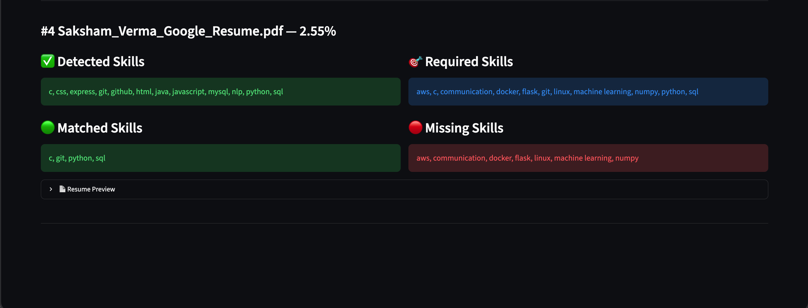

# 📄 Resume Screening & Candidate Ranking System

An AI-powered Resume Screening System built using **Python, Streamlit, and NLP** that automatically compares uploaded resumes against a job description, ranks candidates based on similarity, extracts technical skills, and highlights matched and missing skills.

> **Future Interns – Machine Learning Task 3**

---

## 🚀 Live Demo

**Streamlit App:**  
https://resume-screening-system-saktron.streamlit.app/

---

## 📂 GitHub Repository

https://github.com/saktronX/FUTURE_ML_03

---

## 📌 Features

- Upload one or multiple PDF resumes
- Paste any job description
- Resume text extraction
- NLP text preprocessing
- TF-IDF Vectorization
- Cosine Similarity based candidate ranking
- Automatic skill extraction
- Matched Skills detection
- Missing Skills detection
- Resume preview
- Interactive Streamlit UI

---

## 🛠️ Tech Stack

- Python
- Streamlit
- Pandas
- NumPy
- Scikit-learn
- NLTK
- PyMuPDF (fitz)

---

## 📂 Project Structure

```
Resume-Screening-System/
│
├── app.py
├── requirements.txt
├── README.md
│
├── data/
│   ├── Resume.csv
│   └── monster_com-job_sample.csv
│
├── utils/
│   ├── preprocessing.py
│   └── skill_extractor.py
│
├── notebook/
│   └── Resume_Screening.ipynb
│
└── screenshots/
    ├── home1.png
    ├── upload.png
    ├── ranking.png
    ├── skills.png
    └── skills1.png
```

---

## ⚙️ Installation

Clone the repository

```bash
git clone https://github.com/saktronX/FUTURE_ML_03.git
```

Go inside the project

```bash
cd FUTURE_ML_03
```

Install dependencies

```bash
pip install -r requirements.txt
```

Run the application

```bash
streamlit run app.py
```

---

## 📸 Screenshots

### 🏠 Home Page


---

### 📤 Upload Resume

Upload one or multiple resumes in PDF format and paste the desired job description.


---

### 🏆 Candidate Ranking

Candidates are ranked according to their cosine similarity score with the job description.


---

### 🧠 Extracted Skills

The application automatically extracts technical skills from resumes.


---

### ✅ Skill Match Analysis

Displays:

- Detected Skills
- Required Skills
- Matched Skills
- Missing Skills



---

## 📊 Workflow

1. Upload Resume(s)
2. Paste Job Description
3. Extract Text from PDFs
4. Clean and Preprocess Text
5. Extract Technical Skills
6. Convert Text into TF-IDF Vectors
7. Compute Cosine Similarity
8. Rank Candidates
9. Display Matched & Missing Skills

---

## 📈 Dataset

### Resume Dataset
- Resume.csv

### Job Description Dataset
- monster_com-job_sample.csv

---

## 📚 Machine Learning Concepts Used

- Natural Language Processing (NLP)
- TF-IDF Vectorization
- Cosine Similarity
- Text Cleaning
- Tokenization
- Stopword Removal
- Lemmatization
- Skill Extraction using Keyword Matching

---

## 🎯 Future Improvements

- BERT/Sentence Transformers for semantic matching
- Skill weightage
- ATS Resume Score
- Experience matching
- Education matching
- Recruiter Dashboard
- Resume Recommendation System

---

## 👨‍💻 Author

**Saksham Verma**

GitHub: https://github.com/saktronX

LinkedIn: https://www.linkedin.com/in/saksham-verma-649922277/

---

## ⭐ Acknowledgements

This project was developed as part of the **Future Interns Machine Learning Internship (Task 3)** to demonstrate resume screening, NLP preprocessing, candidate ranking, and skill matching using Python and Streamlit.