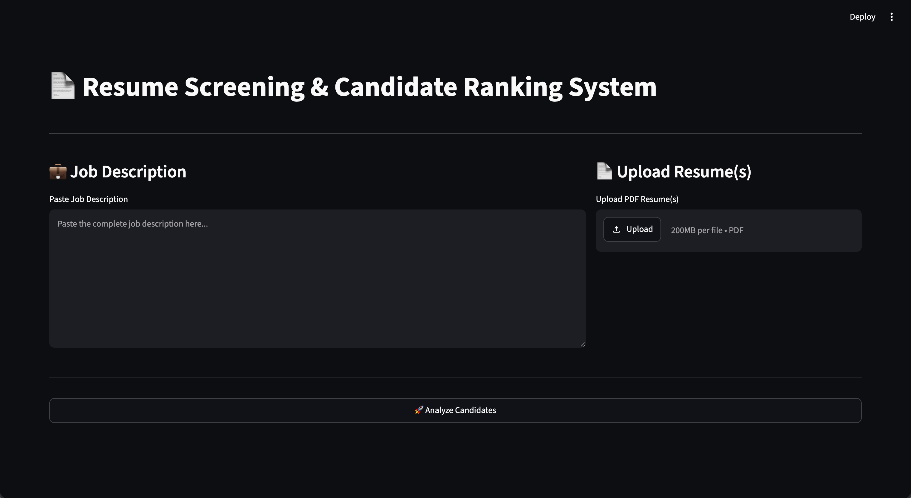
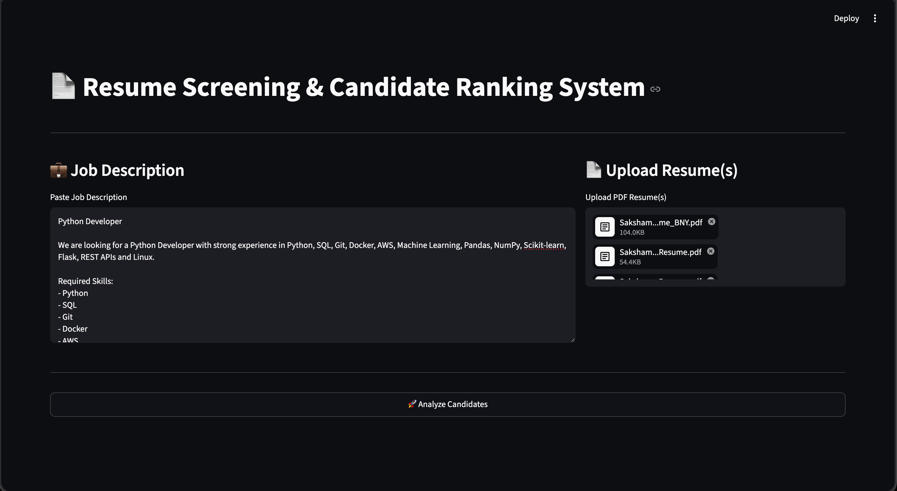
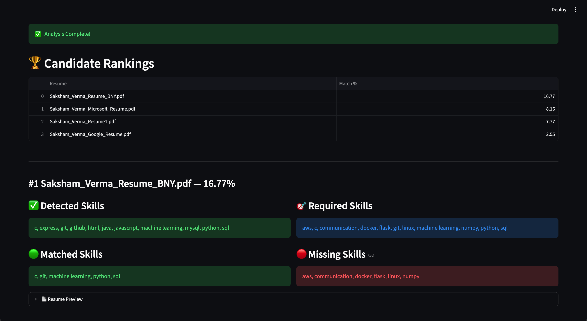
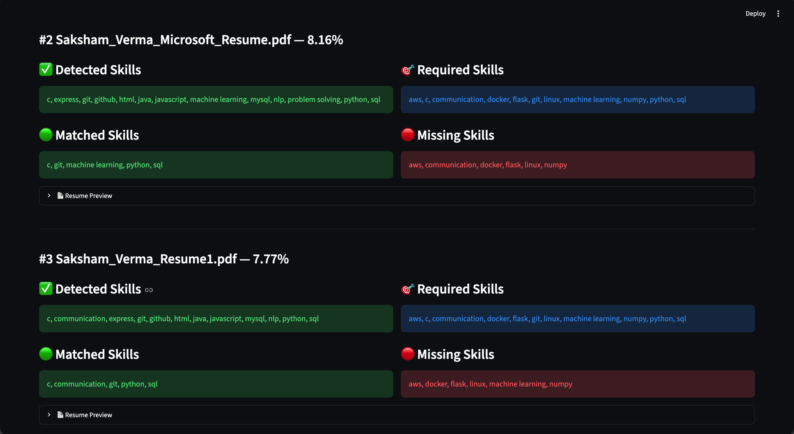

# 📄 Resume Screening & Candidate Ranking System

An AI-powered Resume Screening & Candidate Ranking System built using **Python, NLP, Scikit-learn, and Streamlit**. The application analyzes uploaded resumes, extracts relevant skills, compares them against a job description, ranks candidates based on similarity scores, and highlights matched and missing skills.

---

## 🚀 Live Demo

### 🌐 Streamlit App
https://resume-screening-system-saktron.streamlit.app/

### 💻 GitHub Repository
https://github.com/saktronX/FUTURE_ML_03

---

# 📌 Features

- 📄 Upload one or multiple PDF resumes
- 💼 Paste a job description
- 🧹 Resume text preprocessing using NLP
- 🧠 Automatic skill extraction
- 📊 Resume ranking using TF-IDF & Cosine Similarity
- 🎯 Candidate match score calculation
- ✅ Display matched skills
- ❌ Highlight missing skills
- 🌐 Interactive Streamlit web application

---

# 🛠️ Tech Stack

- Python
- Streamlit
- Scikit-learn
- Pandas
- NumPy
- NLTK
- PDFPlumber

---

# 📂 Dataset

This project uses:

- Resume Dataset (Kaggle)
- Monster.com Job Description Dataset

These datasets were used for resume preprocessing, skill extraction, and candidate ranking.

---

# ⚙️ Project Workflow

1. Upload PDF resume(s).
2. Paste a job description.
3. Extract text from uploaded resumes.
4. Clean and preprocess the text.
5. Extract relevant skills.
6. Convert text into TF-IDF vectors.
7. Compute Cosine Similarity scores.
8. Rank candidates.
9. Display matched and missing skills.

---

# 📁 Project Structure

```text
FUTURE_ML_03/
│
├── app.py
├── README.md
├── requirements.txt
│
├── data/
│   ├── Resume.csv
│   └── monster_com-job_sample.csv
│
├── notebook/
│   └── Resume_Screening.ipynb
│
├── screenshots/
│   ├── home1.png
│   ├── upload.png
│   ├── ranking.png
│   ├── skills.png
│   └── skills1.png
│
└── utils/
    ├── pdf_parser.py
    ├── preprocess.py
    ├── ranking.py
    └── skill_extractor.py
```

---

# 📸 Screenshots

## 🏠 Home Page



---

## 📄 Resume Upload



---

## 🏆 Candidate Ranking



---

## 🧠 Skill Analysis



---

# ⚙️ Installation

### Clone Repository

```bash
git clone https://github.com/saktronX/FUTURE_ML_03.git
```

### Go to Project Folder

```bash
cd FUTURE_ML_03
```

### Install Dependencies

```bash
pip install -r requirements.txt
```

### Run Streamlit

```bash
streamlit run app.py
```

---

# 📊 Results

The application successfully:

- Cleans resume text using NLP.
- Extracts technical skills automatically.
- Compares resumes with a job description.
- Ranks candidates using Cosine Similarity.
- Identifies matched and missing skills.
- Provides an easy-to-use web interface.

---

# 🔮 Future Improvements

- DOCX Resume Support
- Better NLP-based skill extraction
- ATS-style scoring system
- Interactive analytics dashboard
- AI-generated candidate summaries

---

# 👨‍💻 Author

**Saksham Verma**

- GitHub: https://github.com/saktronX
- LinkedIn: *(Add your LinkedIn profile URL here)*

---

# 📜 License

This project was developed as part of the **Future Interns Machine Learning Internship – Task 3** and is intended for educational and portfolio purposes.